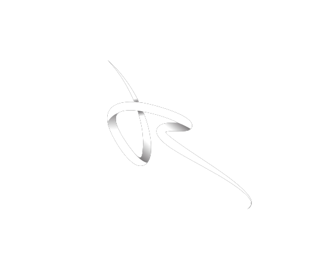

<div align="center">



# 🔐 NexusAuth — Secure Gateway

**A premium, enterprise-grade authentication portal built with React 18**

[](https://developer.mozilla.org/en-US/docs/Web/HTML)
[](https://developer.mozilla.org/en-US/docs/Web/CSS)
[](https://react.dev/)
[](https://developer.mozilla.org/en-US/docs/Web/JavaScript)

*Built by **RJ Pvt Ltd** — Precision. Security. Excellence.*

</div>

---

## 📸 Overview

**NexusAuth** is a sleek, dark-themed authentication portal with a fully client-side architecture. It features role-based access control, real-time form validation, password strength analysis, a live camera capture system, and a drag-and-drop photo gallery — all powered by **React 18** compiled in-browser via **Babel Standalone**.

No build tools. No install. Just open `index.html`.

---

## ✨ Features

### 🔑 Authentication System
| Feature | Details |
|---|---|
| **Sign In** | Email/username + password login with role selection |
| **Register** | Full account creation with real-time validation |
| **Forgot Password** | Secure recovery flow (simulated dispatch) |
| **Role-Based Access** | Separate **Operator** and **Admin** login portals |
| **Remember Me** | Persistent sessions via `localStorage` (30 days) |
| **Session Management** | Smart session/local storage hybrid |

### 🛡️ Security & Validation
- ✅ Real-time inline form validation with error messaging
- ✅ Live **password strength meter** (Weak → Very Strong)
- ✅ Duplicate email detection on registration
- ✅ Role mismatch protection — Admins can't log in via Operator portal & vice versa
- ✅ Toggle password visibility (show/hide)

### 🖼️ Photo Gallery & Camera
- 📷 **Live Camera Feed** — activate webcam and capture snapshots
- 📁 **Drag & Drop Upload** — drop images directly into the gallery
- 🗑️ **Delete Photos** — manage stored images
- 💾 Snapshots stored via `localStorage` per session

### 🎨 UI / UX
- 🌑 **Dark Mode First** — deep glassmorphism design with vibrant gradients
- 🔔 **Toast Notification System** — success, error, warning & info alerts with auto-dismiss
- 📱 Responsive layout with smooth micro-animations
- 🩺 **Boot Diagnostic Overlay** — auto-detects CDN failures and displays helpful debug info
- ⚡ **Zero dependencies to install** — loads React & Babel via CDN

---

## 🗂️ Project Structure

```
📁 WEB/
├── 📄 index.html      # Main app — all React components live here (JSX via Babel)
├── 🎨 style.css       # Full design system — variables, animations, components
├── ⚙️  app.js          # Legacy refactor notice (logic moved to index.html)
└── 🖼️  rj_logo.png     # RJ Pvt Ltd brand logo
```

---

## 🚀 Getting Started

### Prerequisites
- A modern web browser (Chrome, Firefox, Edge, Safari)
- An internet connection *(to load React 18 & Babel from CDN)*

### Run Locally

```bash
# Clone the repository
git clone https://github.com/YOUR_USERNAME/nexusauth.git

# Navigate into the project
cd nexusauth

# Open in browser — no server needed!
start index.html   # Windows
open index.html    # macOS
```

> **Note:** If you're offline, the Boot Diagnostic Overlay will appear and explain the CDN connection issue. Simply connect to the internet and reload.

---

## 🏗️ Architecture

```
index.html
└── <script type="text/babel">
    ├── MockDB Driver        → localStorage-based user store
    ├── Session Manager      → localStorage / sessionStorage hybrid
    ├── Toast Component      → animated notification system
    ├── LoginForm            → role-aware login (Operator / Admin)
    ├── RegisterForm         → account creation + password strength
    ├── ForgotPasswordForm   → recovery flow
    ├── GalleryView          → webcam capture + drag-drop uploads
    └── App (Root)           → orchestrates all views & state
```

All state is managed with **React 18 Hooks** (`useState`, `useEffect`, `useRef`).  
Data is persisted via the **Web Storage API** — no backend required.

---

## 🎨 Design System

| Token | Value |
|---|---|
| Font | `Inter`, `Outfit` (Google Fonts) |
| Theme | Dark with glassmorphism panels |
| Accent | Purple–violet gradient (`hsl(250–280°)`) |
| Error | `hsl(0, 84%, 60%)` |
| Success | `hsl(142, 76%, 36%)` |
| Warning | `hsl(38, 92%, 50%)` |

---

## 🔒 Default Credentials

> This is a **demo application** using client-side storage. Data is stored in your browser's `localStorage`.

To test the app:
1. **Register** a new account via the Sign Up form
2. **Log in** using the same credentials
3. Use role `operator` for standard users, `admin` for elevated access

---

## 🛣️ Roadmap

- [ ] Backend integration (Node.js / Express)
- [ ] JWT-based authentication
- [ ] Real email recovery flow
- [ ] Profile management dashboard
- [ ] Two-factor authentication (2FA)
- [ ] Dark / Light theme toggle

---

## 👤 Author

**RJ Pvt Ltd**

> *Precision. Security. Excellence.*

---

## 📄 License

This project is proprietary and belongs to **RJ Pvt Ltd**.  
All rights reserved © 2026.

---

<div align="center">

Made with ❤️ by **RJ Pvt Ltd**

</div>
